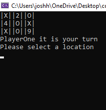

# Lab 04 - Tic Tac Toe
> A console game

To program creates a game of tictactoe which can be played by two users through the console. It uses an array matrix to create a 2d grid for coordinating the user marker and at the end of each turn checks for a winner. If winner conditions are found the winner player is returned.

**Author**: Joshua Haddock
**Collaborators**: Jona Brown, Steven Boston, Benjamin Ibarra, Dave Arno, Miriam Silva.

## Installing / Getting started

Clone the repository to your local machine. Follow the file path Lab04_TicTacToe > Lab04_TicTacToe > bin > Debug > net5.0

Open the executable file Lab04_TicTacToe

## Visual

## Licensing

"The code in this project is licensed under MIT license."